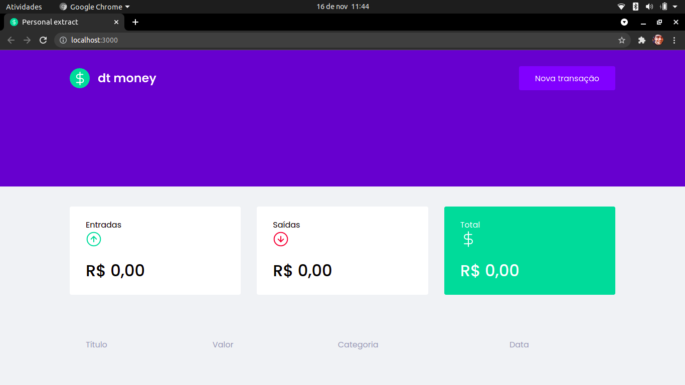
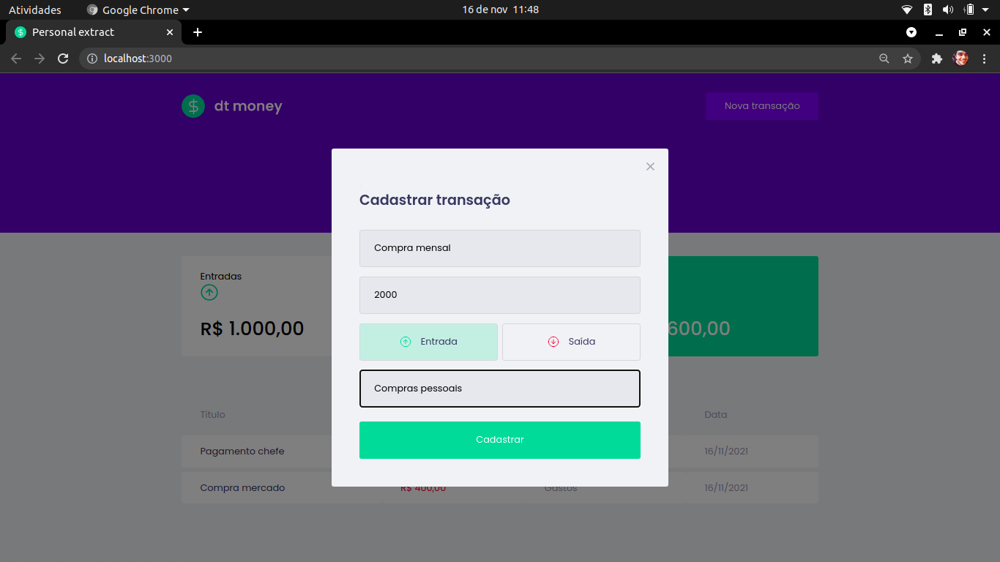

<div align="center" id="top"> 
  
</div>

<hr/>
<br>

## About

This applications is a personal finance management tool.

## Screenshots

<div align="center" id="top"> 
  
</div>
<br/>
<br/>
<div align="center" id="top"> 
  
</div>

## Features

- Table with personal finance data with name, amount, category and date.
- Summary cards with incomes, outcomes and total.
- Button that Create a new transaction using a beautiful modal.

## Technologies

Technologies whith which this project was developed:

- [React](https://pt-br.reactjs.org/)
- [TypeScript](https://www.typescriptlang.org/)
- [MirageJS](https://miragejs.com/)
- [Polished](https://polished.js.org/)
- [Axios](https://github.com/axios/axios)
- [Styled Componensts](https://styled-components.com/)

## Requirements

Before starting 🏁, you need to have [Git](https://git-scm.com) and [Node](https://nodejs.org/en/) installed.

## Starting

```bash
# Clone this project
$ git clone https://github.com/aq-simei/my_money

# Access folder
$ cd dt_money

# Install dependencies
$ yarn install

# Run the project
$ yarn start

# The application will be avalible on: http://localhost:3000
```

## License

This project is under license from MIT. For more details, see the [LICENSE](LICENSE.md) file.


<a href="#top">Back to top</a>
